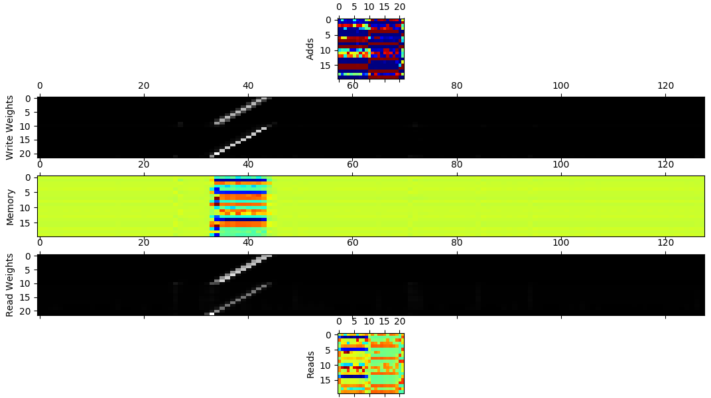

# **Neural Turing Machine**

This is an implementation of the Neural Turing Machine (NTM) by [Graves *et al.*][Graves] in TensorFlow 2.0 Alpha.

## Motivation
This was mainly done to study how the NTM architecture can be implemented in TensorFlow 2.0 with Eager 
Execution. With TensorFlow moving from sessions to function as the mechanism to connect the operations 
together, the implementation of the architecture is quite straight forward. 

The other motivation was studying the NTM architecture itself because it can learn basic algorithms 
and can beat LSTMs in large sequence or time series applications.

## Architecture
The architecture of the NTM implemented here is for the copy task as described in the paper by Graves *et al.*.
So the NTM has one read and write head with a 3-layer feedforward controller. The authors of the NTM is quite vague about the exact architecture and implementation details which are left to the readers to figure out. The architecture
used here is based on this PyTorch implementation by [loudinthecloud][PyTorchNTM] and using suggestions in the paper by [Collier and Beel][Collier] on implementing an NTM.
 
 Since most of the available implementation of NTMs use LSTM layers as the controller and the activation used 
 by the it is tanh, the activations of the feedforward controller also uses tanh which produces the best result. The read bias vector and the write bias vector are not learned but initialized to random value like the PyTorch NTM and uses constant memory initialization using a small value of 10e-6 as suggested in the paper by Collier and Beel.

## Training
Training the NTM was the difficult part in this exercise. The above implementation suggestions and examples is what lead
to the convergence of the model. By following just the proposals in the paper by Graves *et al.* the NTM is quite hard to train. Even with following the above mentioned suggestion the training could not be done in one session. 


The above image is for training the NTM with the Y-axis showing the cost per sequence and the X-axis showing the number of sequences shown to the model. Trying to train the neural network initially with sequences between 1 and 20 caused the 
NTM model to not converge at all. Instead incremental learning seems to be successful. In the graph above the the orange 
plot is for training sequences between 1 to 5 in length, blue for sequences between 1 to 10 and finally the red and cyan plots are for sequences between 1 to 20. This strategy of incremental learning proved successful in training the NTM and successful convergence.

The training consumed a large amount of time and the two large spikes in the red plot consumed addition time to 
converge again, after that the cost is very close to zero and stayed stable in the cyan plot. The training took at least 13 hours. The delay is further increase by not converting the NTM into a static graph by using `tf.function` and instead relying on eager execution.

Trying to learn the read and weight bias vector initially appears to be working as the loss steadily decreases but after
sometime the loss starts to climb rapidly to very high values and the training has to be cut short. Collier and Beel suggests learning the bias vector for better initialization. The problem is most likely some implementation error and further investigation is required.

## Results
#### Sequence length of 10

#### Sequence length of 20

#### Sequence length of 30

#### Sequence length of 50

#### Sequence length of 80

#### Sequence length of 120


For sequences of lengths between 1 and 20 the copy task is executed perfectly by the NTM and it generalizes well to sequences lengths between 30 and 45 without additional training. For sequence lengths above 45, errors start showing up and most of the error occurs during the start of the sequence with missing 8-Bit vectors. For sequence lengths 70 and above the NTM is not stable, meaning it would not produce any significant output or would contain a lot of errors at the start and end like for the sequence length of 120. But these results beat the [LSTMs in the copy task][LSTMCopy].



The above image shows the internal working of the NTM with the adds, reads, memory, write and read weights. The write weights are shifted properly across the memory locations with sharp focus. The additional write weights are observed during the reads and the same can be observed for the read weights with additional read weights during the adds. The read weights are blurred when making the prediction.

## Usage
For training the NTM
```
./train --train --min_sequence=1 --max_sequence=20
```
For testing the NTM with a test input sequence with fixed sequence length
```
./train --test --max_sequence=30
```
For testing with random sequence length
```
./train --test --max_sequence=120 --random_seq_len
```
For visualizing the internal working of the NTM
```
./train --test --visualize --max_sequence=20
```
Available options
```
./train --help

usage: train.py [-h] [--train] [--test] [--visualize] [--random_seq_len]
                [--epochs EPOCHS] [--batches BATCH_SIZE]
                [--steps_per_epoch STEPS_PER_EPOCH]
                [--learning_rate LEARNING_RATE] [--momentum MOMENTUM]
                [--clip_grad_min CLIP_GRAD_MIN]
                [--clip_grad_max CLIP_GRAD_MAX]
                [--controller_size CONTROLLER_SIZE]
                [--memory_locations MEMORY_LOCATIONS]
                [--memory_vector_size MEMORY_VECTOR_SIZE]
                [--maximum_shifts MAXIMUM_SHIFTS] [--learn_r_bias]
                [--learn_w_bias] [--learn_m_bias]
                [--max_sequence MAX_SEQUENCE] [--min_sequence MIN_SEQUENCE]
                [--in_bits IN_BITS] [--out_bits OUT_BITS]
                [--checkpoint_dir CHECKPOINT_DIR] [--max_to_keep MAX_TO_KEEP]
                [--report_interval REPORT_INTERVAL]
                [--train_log_dir TRAIN_LOG_DIR]
```

## References
- [Graves A., Wayne, G. and Danihelka, I. (2014) *‘Neural Turing Machines’*, Neural and
   Evolutionary Computing, arXiv:1410.5401 [cs.NE].][Graves]
- [Collier M. and Beel J. (2018) *'Implementing Neural Turing Machine'*, Machine Learning,
   arXiv:1807.08518 [cs.LG].][Collier]

## Issues
- The training is very slow.
- Very high loss when trying to lear the bias vectors.
- The code is in eager execution mode and a static graph is not generated using `tf.function`.
- Stable for small sequence lengths but not for large sequences

[Graves]:https://arxiv.org/pdf/1410.5401.pdf
[Collier]:https://arxiv.org/pdf/1807.08518.pdf
[PyTorchNTM]:https://github.com/loudinthecloud/pytorch-ntm
[LSTMCopy]:https://github.com/ajithcodesit/lstm_copy_task